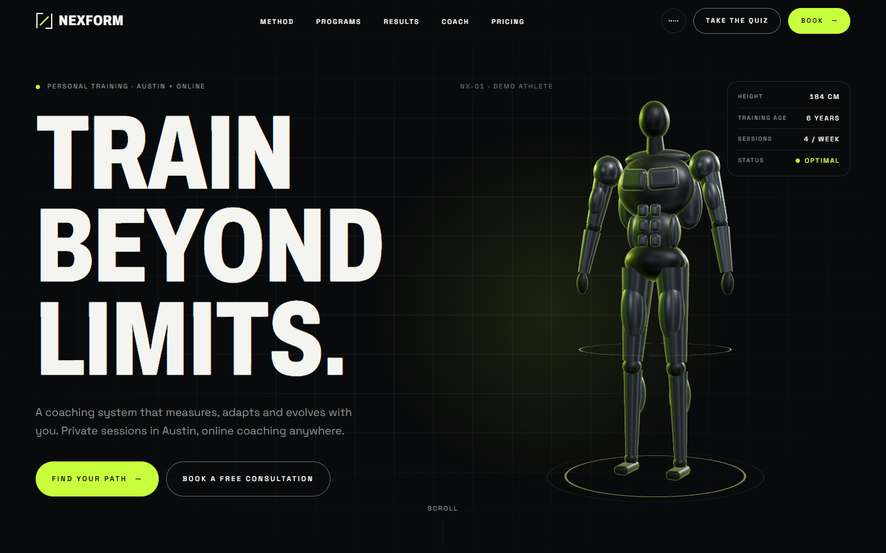
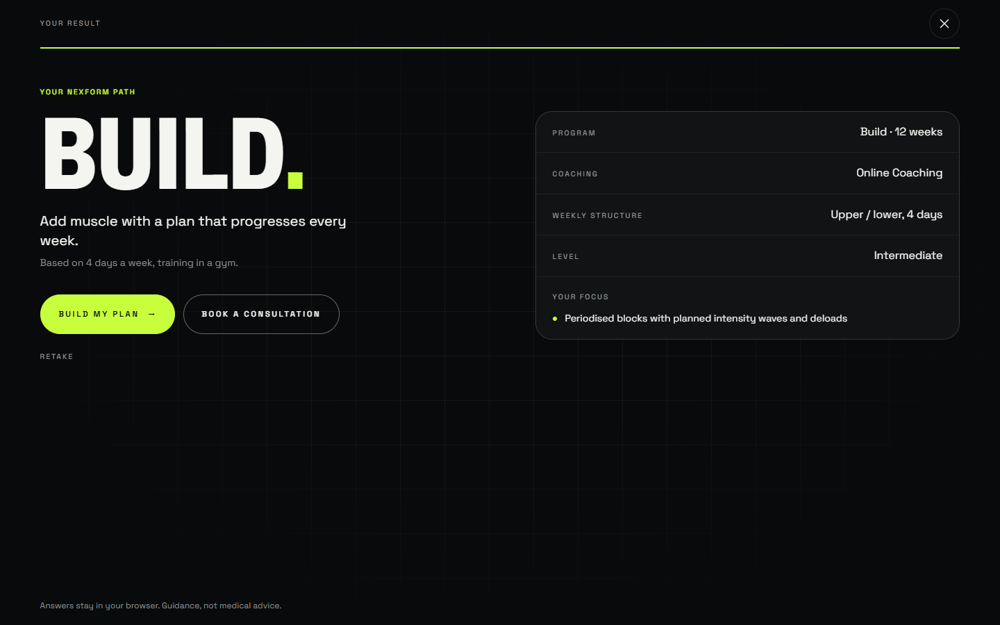
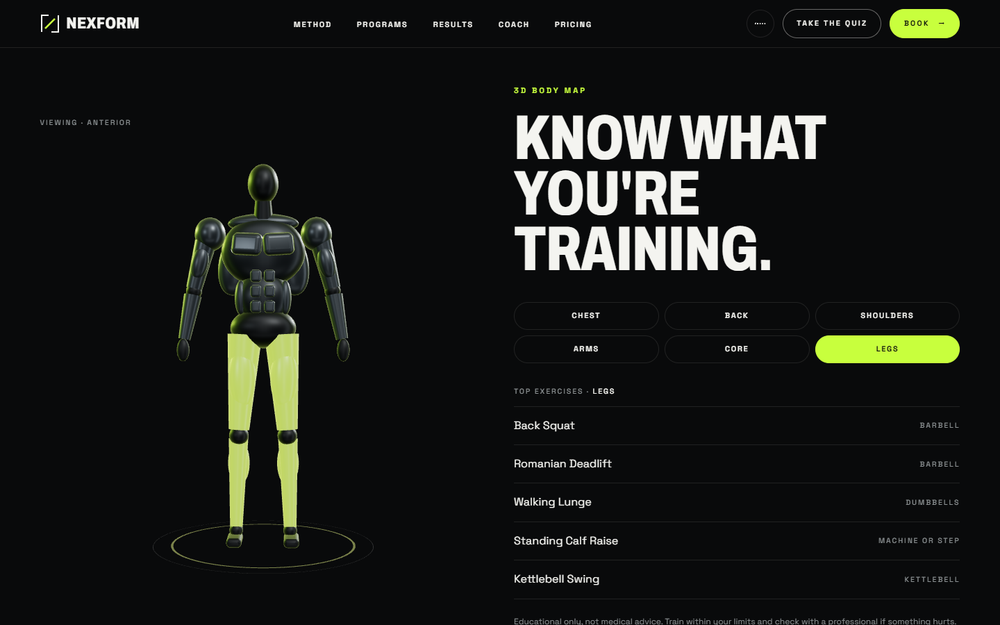
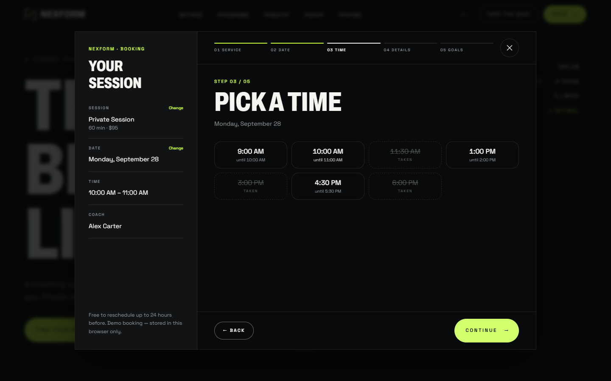
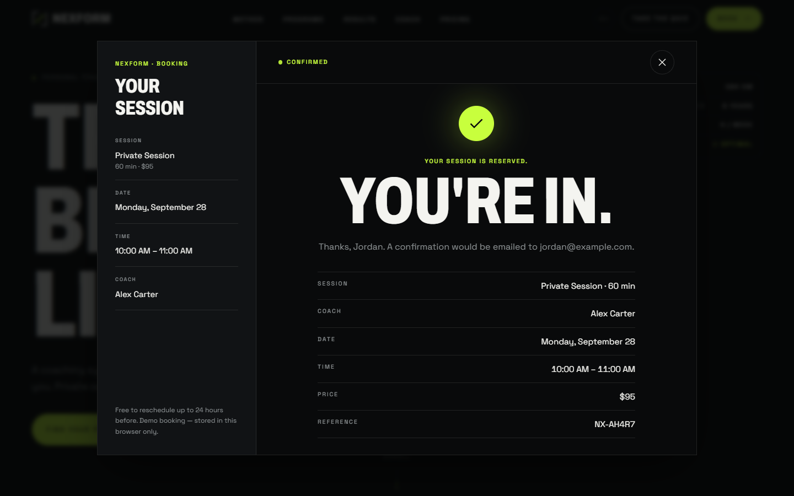
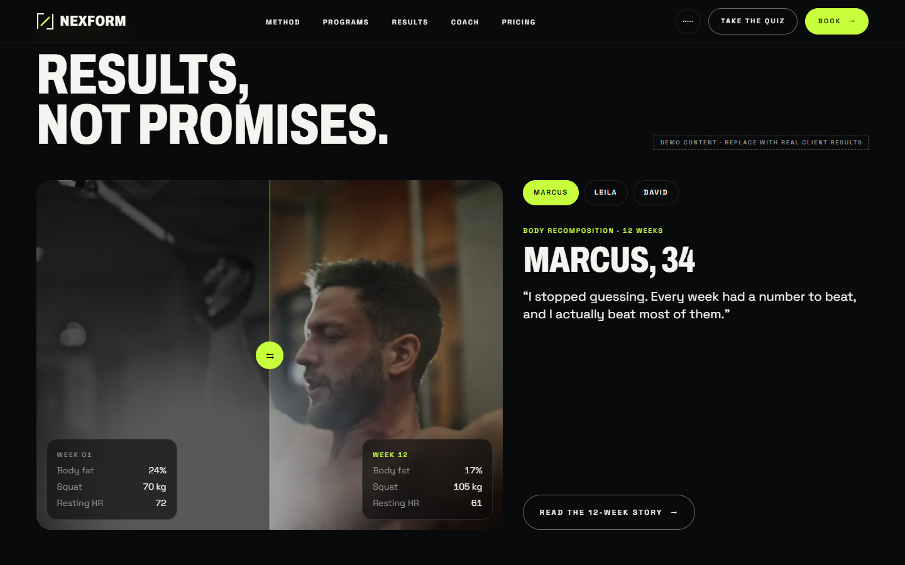
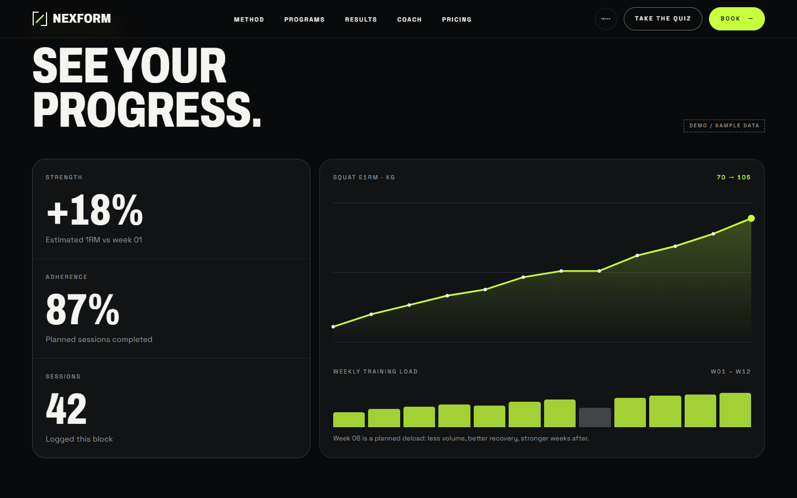
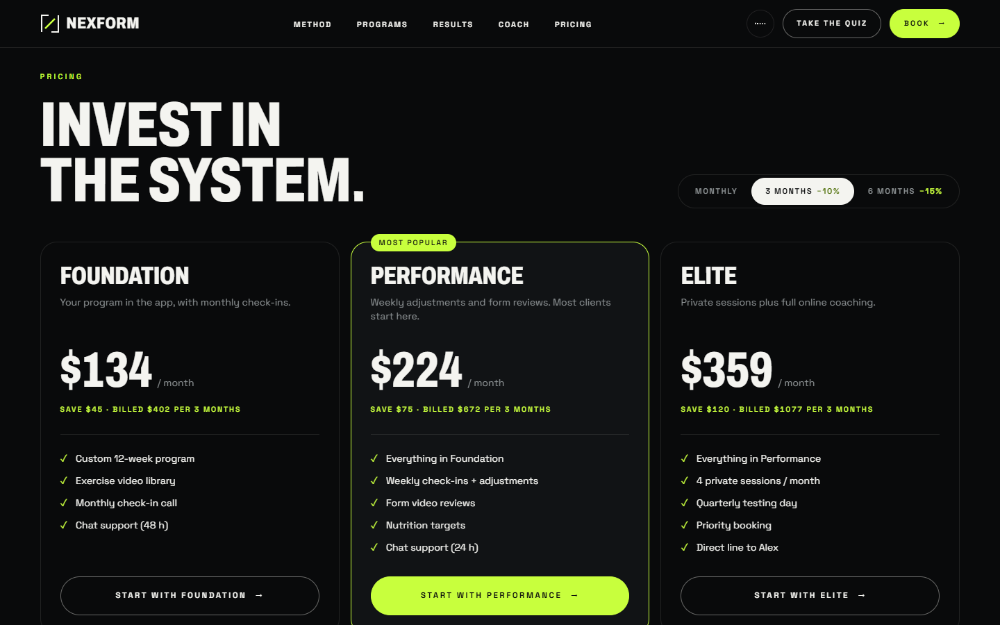
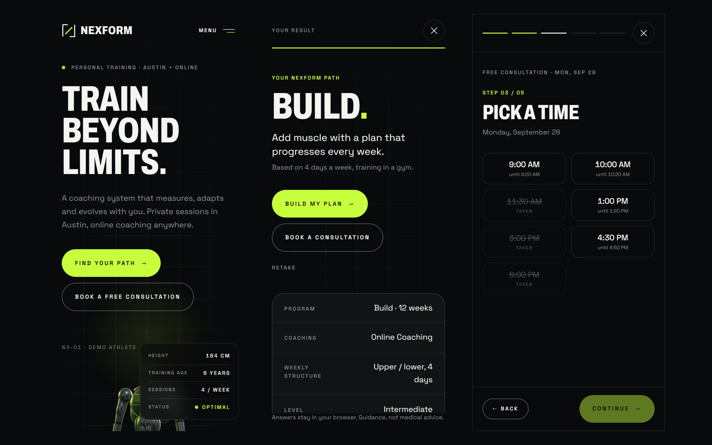

# NEXFORM — Futuristic Personal Trainer Website Template

**Train beyond limits.** A dark, 2030-style website for personal trainers and online coaches:
a 3D athlete built in code, a 60-second personalisation quiz, a 3D body map, and a real booking flow
that ends in **“YOU'RE IN.”**

**[Live demo](https://nexform-muad1.vercel.app)** · **[Get the template ($49)](https://muadme.gumroad.com/l/ufsnay)**

## What's inside

- **3D athlete hero** with a live data HUD, pointer tilt and scroll-driven camera. It falls back to
  pre-rendered stills on phones, weak devices, reduced motion and Lite mode.
- **Personalisation quiz**: goal, days, location, experience, obstacle and age → *YOUR NEXFORM PATH*
  (program, coaching format, weekly structure, focus). One click goes to the program or to booking.
- **Program explorer** (BUILD / LEAN / PERFORM / MOVE), **workout preview** (DAY 01 / LOWER BODY) and a
  filterable **exercise library** with cues, tempo and RPE.
- **3D body map**: pick CHEST, BACK, SHOULDERS, ARMS, CORE or LEGS to light up the muscle group and list exercises for it.
- **Results**: before/after data slider, 12-week client stories, progress dashboard, 12-week timeline
  (all clearly labelled demo content).
- **Booking in 5 steps**: session, date, time, details, goals, then a confirmation with Google Calendar and .ics links.
  Includes live next-slot availability.
- **Pricing** with monthly / 3-month / 6-month terms, animated prices and savings.
- Coach profile, video testimonials with captions, nutrition, recovery readiness ring, community, journal, FAQ.

## Built with

React 19 · TypeScript · Vite · Tailwind CSS v4 · three.js / react-three-fiber. One central config file
controls the whole site. There's no backend: the demo booking engine runs in the browser and has two
functions to swap for your real calendar API.

**Lighthouse** (production build): mobile 95 / 100 / 100 / 100 · desktop 99 / 100 / 100 / 100.

---

This repository is a showcase. The full source code is available as a paid template.
Built by [Mouad Sehli](https://muad-portfolio.vercel.app).
